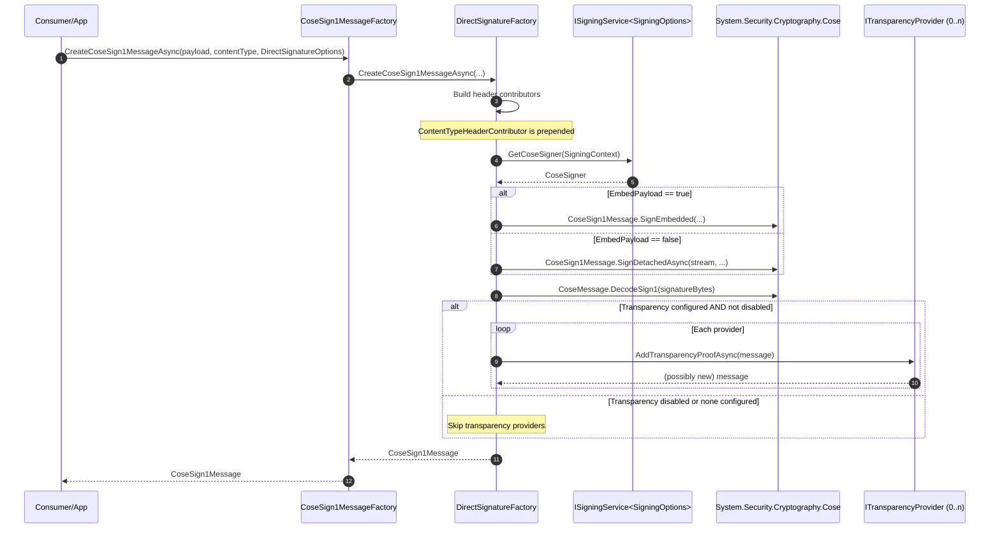
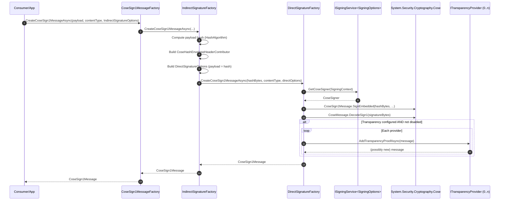
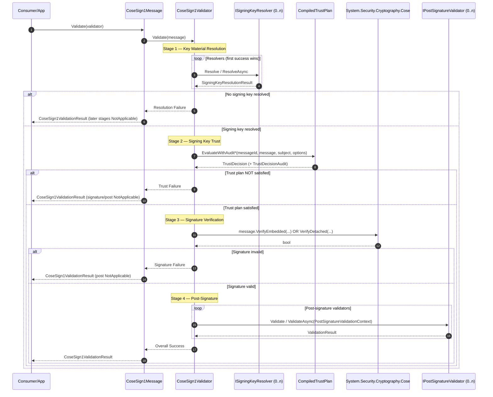
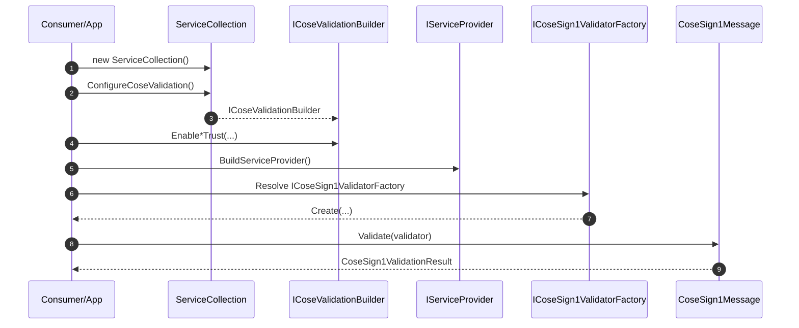
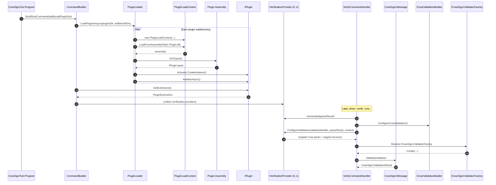

# Sequence Diagrams

This page contains Mermaid sequence diagrams that document the **runtime call ordering** and the **dependency graph** across CoseSignTool V2’s major subsystems.

> These diagrams are based on the current V2 implementation (factories, validator orchestration, default-component discovery, and CLI plugin loading).

---

## Signing (Direct)

The preferred entry point is `CoseSign1MessageFactory`, which routes based on the runtime type of `SigningOptions`.

Notes:
- **Transparency proofs are applied only by the async message-returning APIs** (e.g., `CreateCoseSign1MessageAsync`). The byte-returning APIs (`CreateCoseSign1MessageBytes*`) produce a valid signature but do not apply transparency.

---

## Signing (Indirect / Hash Envelope)

Indirect signatures hash the payload and sign the hash, while storing the hash-envelope metadata in protected headers.

---

## Validation (Staged Orchestration)

`CoseSign1Validator` enforces the secure-by-default stage ordering:
1) key material resolution → 2) trust → 3) signature verification → 4) post-signature policy.

---

## Validation (DI Composition)

V2 validation is configured via DI. You opt into trust packs (and related staged services) via `ConfigureCoseValidation()` and `Enable*Trust(...)`, then create an `ICoseSign1Validator` using `ICoseSign1ValidatorFactory`.

---

## CLI (Plugin Loading → Verify)

The CLI uses plugins to contribute signing commands, verification providers, and transparency providers.

---

## See Also

- Validation framework: `CoseSign1.Validation` (staged orchestration)
- Signing factories: `CoseSign1.Factories` (direct + indirect)
- Plugin model: `CoseSignTool.Abstractions` + `CoseSignTool` (CLI)
