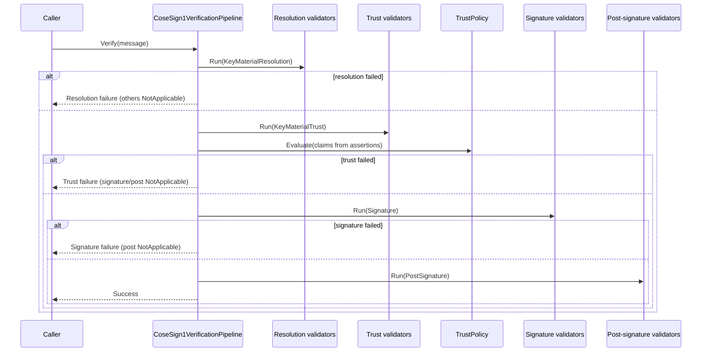
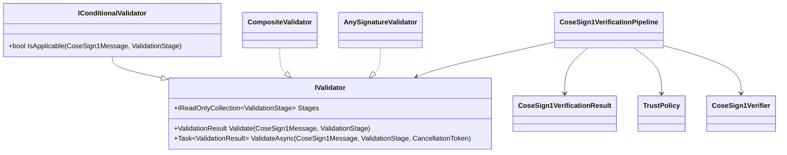

# Validation Framework

This document describes the composable validation framework in CoseSignTool V2, including the staged (trust-first) verification pipeline.

## Overview

V2 validation is **stage-aware**.

- Validators declare which stages they participate in.
- Orchestrators run stages in a secure-by-default order.
- Validators can declare themselves **not applicable** for a given input.

The preferred consumer-facing orchestration is the immutable `CoseSign1VerificationPipeline` (built via `Cose.Sign1Verifier()`), which consistently enforces:

1. Key material resolution
2. Key material trust
3. Signature verification
4. Post-signature policy

## Core Concepts

### ValidationStage

Stages indicate *when* a validator should run, not whether it applies.

```csharp
public enum ValidationStage
{
    KeyMaterialResolution = 0,
    KeyMaterialTrust = 1,
    Signature = 2,
    PostSignature = 3
}
```

### IValidator

All validators implement the non-generic `IValidator` interface.

```csharp
public interface IValidator
{
    IReadOnlyCollection<ValidationStage> Stages { get; }

    ValidationResult Validate(CoseSign1Message input, ValidationStage stage);

    Task<ValidationResult> ValidateAsync(
        CoseSign1Message input,
        ValidationStage stage,
        CancellationToken cancellationToken = default);
}
```

### Conditional Validators

Validators can optionally implement `IConditionalValidator` to opt out for specific inputs.

```csharp
public interface IConditionalValidator : IValidator
{
    bool IsApplicable(CoseSign1Message input, ValidationStage stage);
}
```

`CompositeValidator` will skip conditional validators when `IsApplicable(...)` returns `false`.

### ValidationResult

`ValidationResult` supports three outcomes:

- Success
- Failure
- NotApplicable

```csharp
public sealed class ValidationResult
{
    public ValidationResultKind Kind { get; init; }
    public ValidationStage? Stage { get; init; }

    public bool IsValid { get; }
    public bool IsFailure { get; }
    public bool IsNotApplicable { get; }

    public string ValidatorName { get; init; }
    public IReadOnlyList<ValidationFailure> Failures { get; init; }
    public IReadOnlyDictionary<string, object> Metadata { get; init; }
}
```

## Composition

### CompositeValidator

Use `CompositeValidator` to run multiple validators for a stage and aggregate failures.

```csharp
var composite = new CompositeValidator(new IValidator[]
{
    new CertificateKeyMaterialResolutionValidator(allowUnprotectedHeaders: true),
    new CertificateChainValidator(allowUnprotectedHeaders: true),
});

ValidationResult resolution = composite.Validate(message, ValidationStage.KeyMaterialResolution);
ValidationResult trust = composite.Validate(message, ValidationStage.KeyMaterialTrust);
```

### Signature validation orchestration

When multiple signature-verification strategies exist, V2 uses `AnySignatureValidator` and requires:

> At least one applicable signature validator must succeed.

## Staged verification (trust-first)

`CoseSign1VerificationPipeline` orchestrates the stages and short-circuits failures. Internally it delegates to `CoseSign1Verifier`.

```csharp
var pipeline = Cose.Sign1Verifier()
    .AddResolutionValidators(resolutionValidators)
    .AddTrustValidators(trustValidators)
    .RequireTrust(trustPolicy)
    .AddSignatureValidators(signatureValidators)
    .AddPostSignatureValidators(postSignatureValidators)
    .Build();

var result = pipeline.Verify(message);

if (!result.Trust.IsValid)
{
    // Trust failures happen before signature verification.
}
```

### Sequence (high level)



### Class structure (key types)



## See Also

- [Creating Custom Validators](../guides/custom-validators.md)
- [CoseSign1.Validation](../components/validation.md)
- [Architecture Overview](overview.md)
