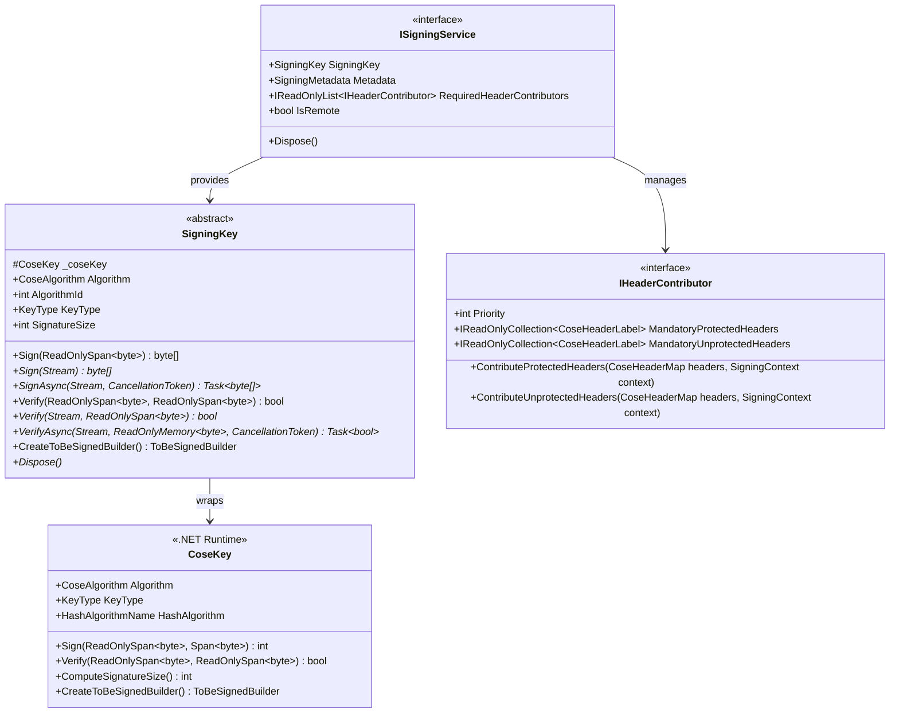
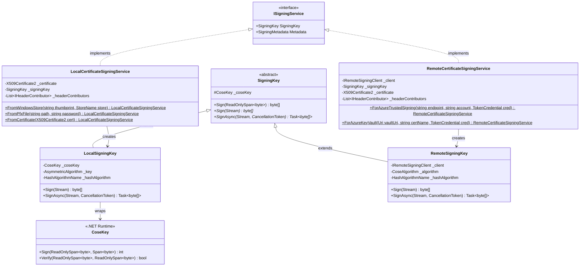
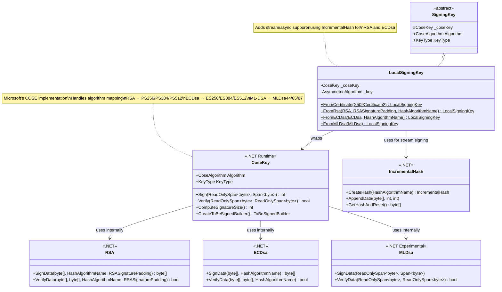
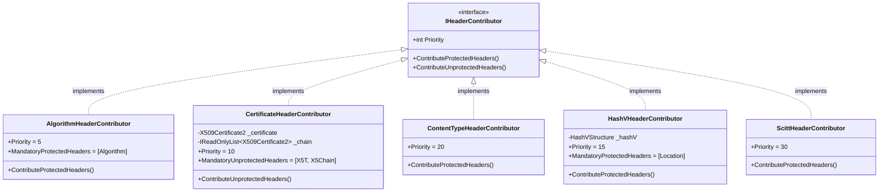
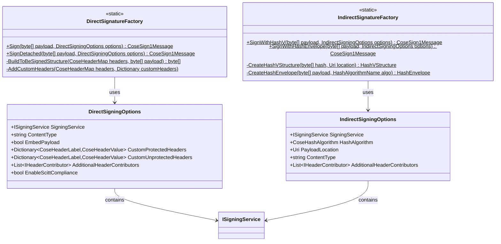
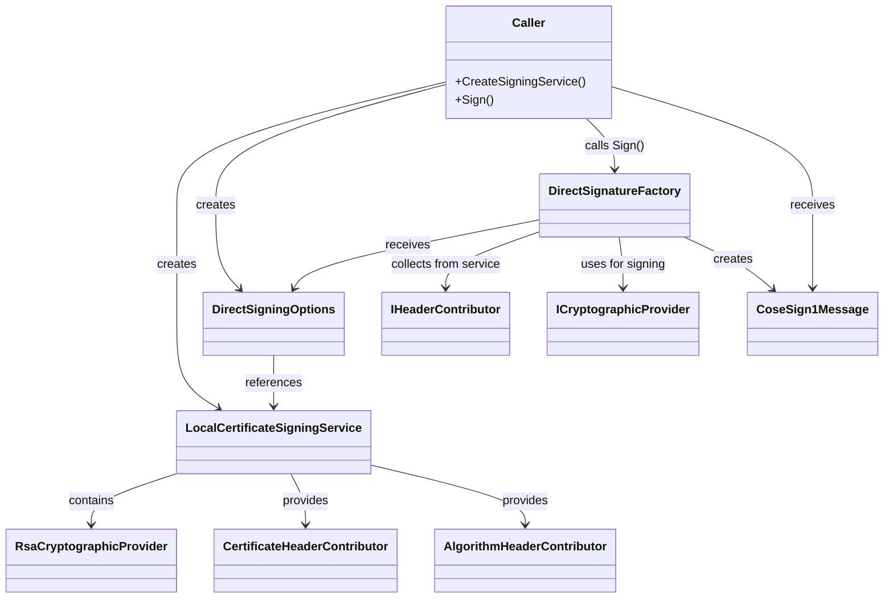
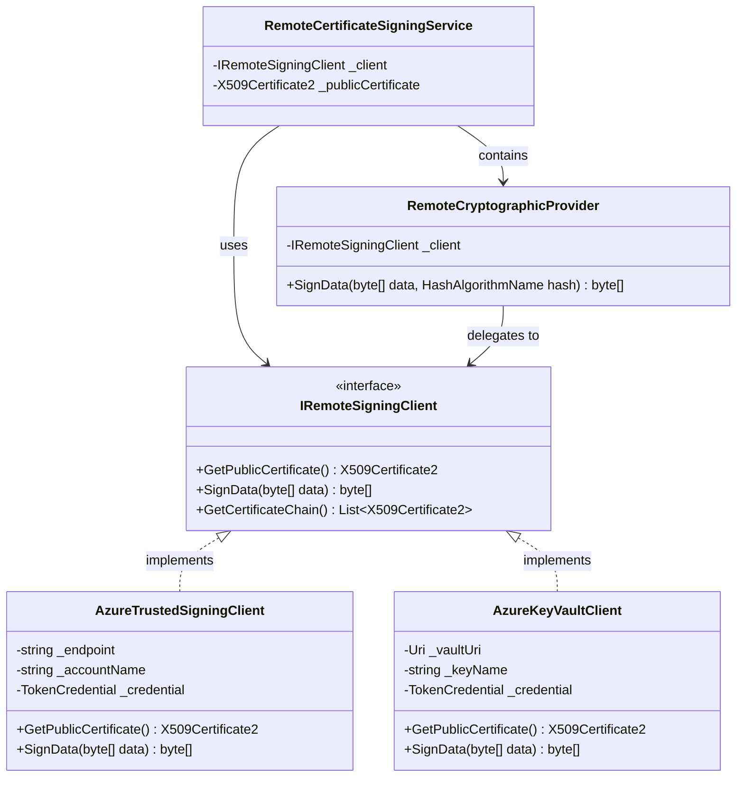
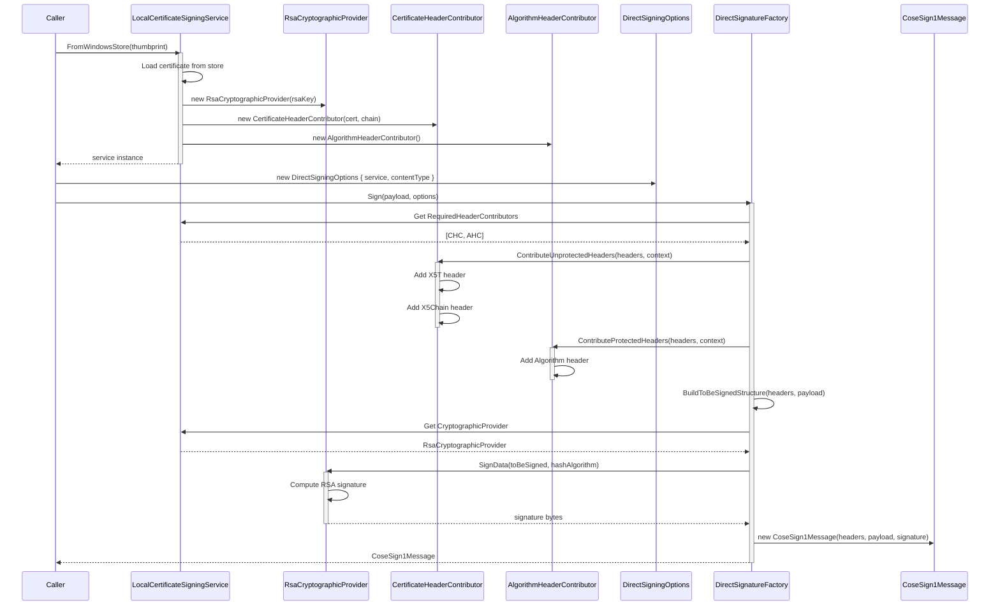
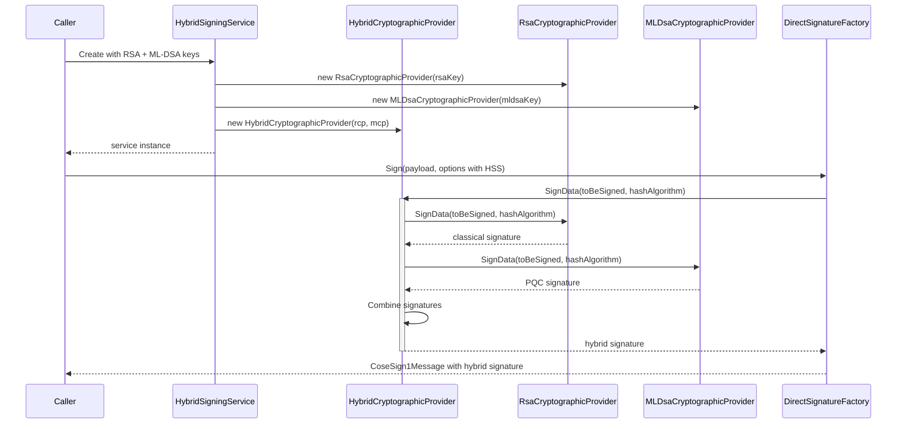
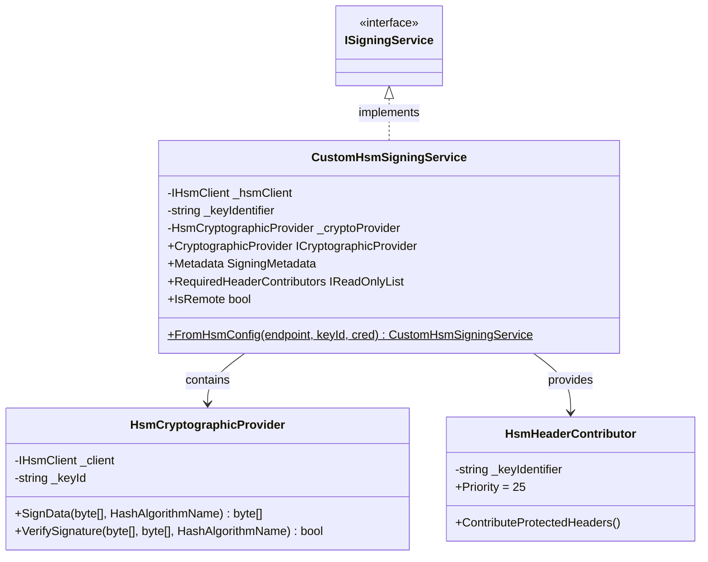

# V3 Architecture - Detailed Class Diagrams

## Core Interface Hierarchy



## Signing Service and SigningKey Hierarchy



## CoseKey Integration and Key Type Support



## Header Contributor Hierarchy



## Factory and Options



## Complete Object Composition



## Remote Signing Architecture



## Signing Flow - Object Interactions



## PQC Hybrid Signing Flow



## Extension Point - Custom Signing Service



## Data Flow Architecture

```
┌─────────────┐
│   Payload   │
└──────┬──────┘
       │
       ▼
┌─────────────────────────────────────────┐
│     DirectSignatureFactory.Sign()       │
│  1. Collect header contributors         │
│  2. Execute contributors (priority)     │
│  3. Build protected headers map         │
│  4. Build unprotected headers map       │
└──────┬──────────────────────────────────┘
       │
       ▼
┌─────────────────────────────────────────┐
│    Build ToBeSigned Structure           │
│  Sig_structure = [                      │
│    "Signature1",                        │
│    protected_headers_bstr,              │
│    empty_or_serialized_ext_aad,         │
│    payload                              │
│  ]                                      │
└──────┬──────────────────────────────────┘
       │
       ▼
┌─────────────────────────────────────────┐
│  ICryptographicProvider.SignData()      │
│  • Hash the ToBeSigned structure        │
│  • Sign the hash with private key       │
│  • Return signature bytes               │
└──────┬──────────────────────────────────┘
       │
       ▼
┌─────────────────────────────────────────┐
│      Create CoseSign1Message            │
│  • Protected headers (CBOR encoded)     │
│  • Unprotected headers (CBOR encoded)   │
│  • Payload (embedded or null)           │
│  • Signature bytes                      │
└──────┬──────────────────────────────────┘
       │
       ▼
┌─────────────┐
│   Return    │
│  Message    │
└─────────────┘
```

## Component Responsibility Matrix

| Component | Responsibility | Knows About | Doesn't Know About |
|-----------|---------------|-------------|-------------------|
| **ISigningService** | Coordinate signing operations | CryptographicProvider, HeaderContributors, Metadata | COSE message structure, Factory logic |
| **ICryptographicProvider** | Sign/verify data | Key material, algorithms | COSE headers, Certificates |
| **IHeaderContributor** | Add headers to COSE message | Header labels, values, context | Signing logic, key material |
| **DirectSignatureFactory** | Orchestrate signing flow | Options, headers, signing service | Key details, certificate internals |
| **IndirectSignatureFactory** | Orchestrate indirect signing | Hash structures, locations | Key details, signing internals |
| **LocalCertificateSigningService** | Manage local certificate | Certificate, chain, local crypto | Remote services, factory logic |
| **RemoteCertificateSigningService** | Manage remote signing | Remote client, public cert | Local key storage, factory logic |

## Layer Separation

```
┌─────────────────────────────────────────────────────────┐
│                    CALLER LAYER                          │
│  • Creates signing services                             │
│  • Creates options                                      │
│  • Calls factories                                      │
│  • Receives signed messages                             │
└─────────────────────────────────────────────────────────┘
                          │
                          ▼
┌─────────────────────────────────────────────────────────┐
│                   FACTORY LAYER                          │
│  • Orchestrates signing flow                            │
│  • Collects header contributors                         │
│  • Builds COSE message structure                        │
│  • Returns CoseSign1Message                             │
└─────────────────────────────────────────────────────────┘
                          │
                          ▼
┌─────────────────────────────────────────────────────────┐
│                  SERVICE LAYER                           │
│  • Provides cryptographic provider                      │
│  • Provides header contributors                         │
│  • Manages certificates/keys                            │
│  • Abstracts local vs remote                            │
└─────────────────────────────────────────────────────────┘
                          │
                          ▼
┌─────────────────────────────────────────────────────────┐
│              CRYPTOGRAPHIC LAYER                         │
│  • Sign data with keys                                  │
│  • Verify signatures                                    │
│  • Encrypt/decrypt (if supported)                       │
│  • Abstract RSA/ECDsa/ML-DSA/etc.                       │
└─────────────────────────────────────────────────────────┘
                          │
                          ▼
┌─────────────────────────────────────────────────────────┐
│                 HEADER LAYER                             │
│  • Add mandatory headers                                │
│  • Add optional headers                                 │
│  • Priority-based execution                             │
│  • Context-aware contribution                           │
└─────────────────────────────────────────────────────────┘
```

This architecture ensures clean separation of concerns with well-defined boundaries between layers.
