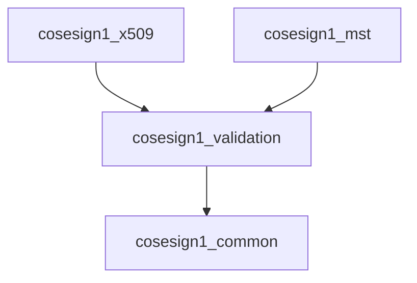
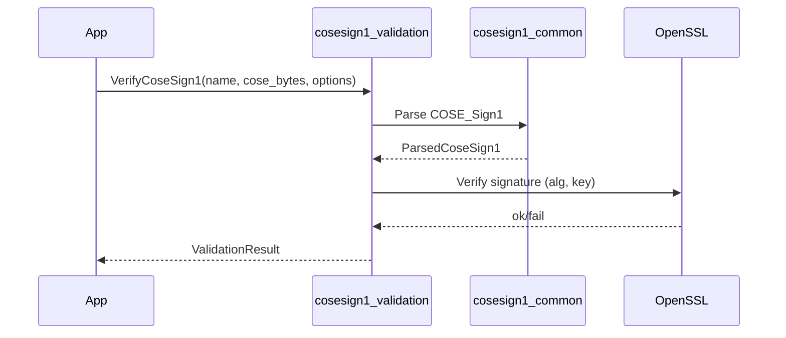
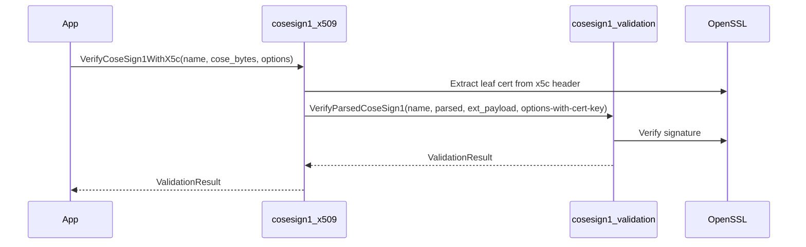
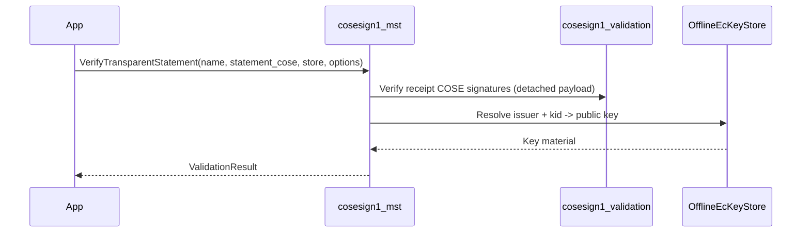

# Architecture

## Packages and responsibilities

These native libraries are designed as small, composable layers:

- **`cosesign1_common`**
  - CBOR primitives + a parsed COSE_Sign1 model (`cosesign1::common::cbor::ParsedCoseSign1`).

- **`cosesign1_validation`** (source folder: `native/cosesign1-validation`)
  - Base types for validation results.
  - Low-level COSE_Sign1 signature verification.
  - Optional post-quantum signature verification (ML-DSA) via liboqs.
  - A small *pipeline* abstraction (builder + composite validator) for composing rules.

- **`cosesign1_x509`**
  - X.509 / `x5c` integration: extract leaf certificate from COSE headers and verify the COSE signature.

- **`cosesign1_mst`**
  - MST verification for “transparent statements” containing receipts.
  - Offline-first verification using an `OfflineEcKeyStore`, with optional network JWKS fetch.

## Dependency graph

External dependencies are kept at the edges:

- OpenSSL: used by `cosesign1_validation`, `cosesign1_x509`, `cosesign1_mst`
- tinycbor: used to parse/emit CBOR structures
- liboqs (optional): used by `cosesign1_validation` when PQC is enabled
- nlohmann-json + libcurl: used by `cosesign1_mst` for JWKS parsing and optional network fetch

## Validation results

Native code reports problems via `cosesign1::validation::ValidationResult`:

- `is_valid`: success/failure
- `failures`: zero or more failures
- `metadata`: optional key/value metadata emitted by validators

Many call sites accept a `validator_name` string used to identify the source of results.

## “Verifier” vs “Validator”

This repo uses two related concepts:

- **Verifier (function)**: an entry point that validates a full COSE_Sign1 blob or a parsed model.
  - Examples: `VerifyCoseSign1`, `VerifyCoseSign1WithX5c`, `VerifyTransparentStatement`.

- **Validator (class)**: a single rule that can be composed into a pipeline.
  - Interface: `cosesign1::validation::ICoseSign1Validator`.
  - Composition: `CompositeCoseSign1Validator`.

In practice:

- If you have one thing to check: use a verifier function.
- If you want to run multiple rules and aggregate results: use the builder/pipeline.

## Typical flows (sequence diagrams)

### COSE_Sign1 signature verification

### X.509 (`x5c`) based verification

### MST statement verification (offline-first)

