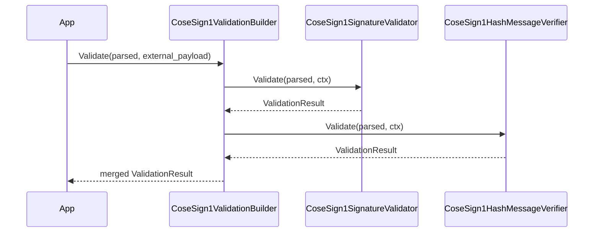

# COSE Hash Envelope payload-hash verifier

This verifier validates a COSE_Sign1 that embeds a payload hash (rather than the original payload).

## Concept

- The COSE_Sign1 payload is expected to contain a hash digest.
- The real payload bytes are provided out-of-band (detached bytes).
- The verifier computes the digest over those external bytes and compares it to the embedded payload.

## Entry point

Header: `cosesign1/validation/cose_sign1_hash_message_verifier.h`

- Class: `cosesign1::validation::CoseSign1HashMessageVerifier`
- Method: `ValidationResult Validate(const ParsedCoseSign1& input, const CoseSign1ValidationContext& context) const`

This type is designed to be used in a pipeline (builder/composite), but you can call it directly if you already have a parsed COSE_Sign1.

## Header rules enforced

The implementation enforces draft rules:

- `payload-hash-alg` (label 258) must be **protected-only**.
- External payload bytes must be provided via `CoseSign1ValidationContext` (or via the verifier’s payload provider).

Supported hash algorithms:

- SHA-256 (`-16`)
- SHA-384 (`-43`)
- SHA-512 (`-44`)

## Example: use in a validation pipeline

```cpp
#include <cosesign1/validation/cose_sign1_hash_message_verifier.h>
#include <cosesign1/validation/cose_sign1_validation_builder.h>
#include <cosesign1/validation/cose_sign1_signature_validator.h>

cosesign1::validation::ValidationResult VerifyHashEnvelope(
    const cosesign1::validation::ParsedCoseSign1& parsed,
    std::span<const std::uint8_t> external_payload,
    std::vector<std::uint8_t> spki_der) {

  using namespace cosesign1::validation;

  VerifyOptions sig_opt;
  sig_opt.public_key_bytes = std::move(spki_der);

  CoseSign1ValidationBuilder b;
  b.AddValidator(std::make_shared<CoseSign1SignatureValidator>("Signature", std::move(sig_opt)));
  b.AddValidator(std::make_shared<CoseSign1HashMessageVerifier>());

  return b.Validate(parsed, external_payload);
}
```

## Sequence diagram


