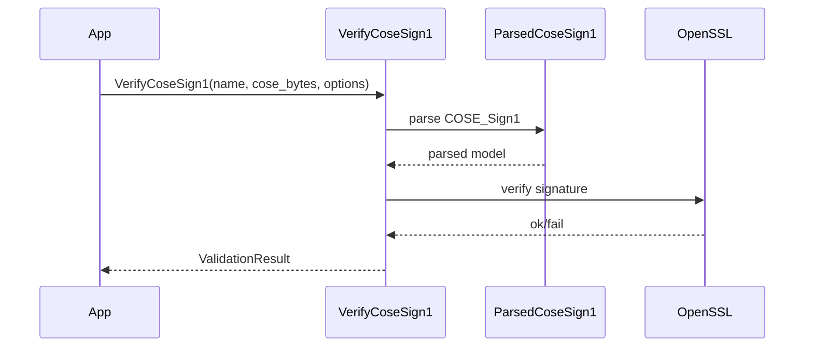

# COSE_Sign1 signature verifier (`cosesign1_signature`)

## Entry points

Header: `cosesign1/validation/cose_sign1_verifier.h`

- `cosesign1::validation::VerifyCoseSign1(...)`
- `cosesign1::validation::VerifyParsedCoseSign1(...)`

## Data model

- Input bytes are parsed into `cosesign1::common::cbor::ParsedCoseSign1`.
- Signature verification uses `cosesign1::validation::VerifyOptions`.

Key fields in `VerifyOptions`:

- `public_key_bytes`:
  - classic algorithms: DER SPKI *or* DER X.509 certificate
  - PQC (ML-DSA): raw public key bytes (liboqs format)
- `external_payload` / `external_payload_provider`: required if the COSE payload is detached (`null`)
- `expected_alg`: optional enforcement of the COSE `alg` header

## Example: verify a COSE_Sign1 with embedded payload

```cpp
#include <cosesign1/validation/cose_sign1_verifier.h>

using cosesign1::validation::VerifyCoseSign1;
using cosesign1::validation::VerifyOptions;
using cosesign1::validation::CoseAlgorithm;

cosesign1::validation::ValidationResult Verify(const std::vector<std::uint8_t>& cose,
                                               const std::vector<std::uint8_t>& spki_der) {
  VerifyOptions opt;
  opt.public_key_bytes = spki_der;
  opt.expected_alg = CoseAlgorithm::ES256;

  return VerifyCoseSign1("Signature", cose, opt);
}
```

## Example: verify a COSE_Sign1 with detached payload

If the COSE_Sign1 payload is `null`, you must provide external bytes:

```cpp
#include <cosesign1/validation/cose_sign1_verifier.h>

cosesign1::validation::ValidationResult VerifyDetached(
    const std::vector<std::uint8_t>& cose,
    const std::vector<std::uint8_t>& external_payload,
    const std::vector<std::uint8_t>& spki_der) {

  cosesign1::validation::VerifyOptions opt;
  opt.public_key_bytes = spki_der;
  opt.external_payload = external_payload;

  return cosesign1::validation::VerifyCoseSign1("Signature", cose, opt);
}
```

## Sequence diagram



## Composing multiple validators

If you want to apply multiple independent rules (e.g., signature check + hash-envelope check + custom claim checks), use the builder/pipeline:

- `cosesign1/validation/cose_sign1_validation_builder.h`
- `cosesign1::validation::CoseSign1ValidationBuilder`

Pipeline validators implement `cosesign1::validation::ICoseSign1Validator`.
