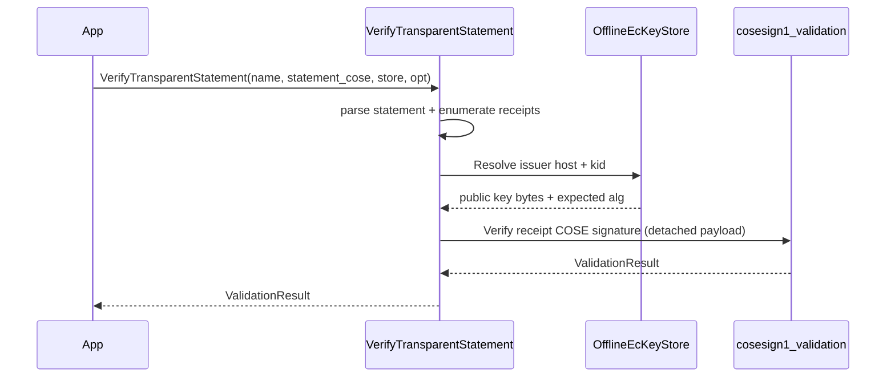

# MST receipt verifier (`cosesign1_mst`)

This package verifies Microsoft Signing Transparency (MST) receipts embedded in a “transparent statement” COSE_Sign1.

## Entry points

Header: `cosesign1/mst/mst_verifier.h`

- Offline-only:
  - `cosesign1::mst::VerifyTransparentStatement(...)`

- Offline-first with optional network JWKS fetch:
  - `cosesign1::mst::VerifyTransparentStatementOnline(...)`

- Receipt-only verification:
  - `cosesign1::mst::VerifyTransparentStatementReceipt(...)`

## Key management

MST verification is designed to be offline-first.

- Keys are provided via `cosesign1::mst::OfflineEcKeyStore`.
- Keys can be populated from JWKS documents.
- Online verification can optionally fetch JWKS via HTTPS and cache into the `OfflineEcKeyStore`.

## Example: offline verification

```cpp
#include <cosesign1/mst/mst_verifier.h>

cosesign1::validation::ValidationResult VerifyMstOffline(
    const std::vector<std::uint8_t>& transparent_statement,
    const cosesign1::mst::OfflineEcKeyStore& store) {

  cosesign1::mst::VerificationOptions opt;
  // Configure opt as needed (authorized domains, behavior, jwks path, etc.)

  return cosesign1::mst::VerifyTransparentStatement("MST", transparent_statement, store, opt);
}
```

## Example: online (with JWKS fetch)

```cpp
#include <cosesign1/mst/mst_verifier.h>

cosesign1::validation::ValidationResult VerifyMstOnline(
    const std::vector<std::uint8_t>& transparent_statement) {

  cosesign1::mst::OfflineEcKeyStore cache;
  cosesign1::mst::VerificationOptions opt;
  opt.allow_network_key_fetch = true;

  return cosesign1::mst::VerifyTransparentStatementOnline("MST", transparent_statement, cache, opt);
}
```

## Receipt-only verification

`VerifyTransparentStatementReceipt` is useful when you already have:

- a single receipt (COSE_Sign1)
- the detached signed claims bytes
- the issuer public key in JWK form (`JwkEcPublicKey`)

```cpp
#include <cosesign1/mst/mst_verifier.h>

cosesign1::validation::ValidationResult VerifyReceiptOnly(
    const cosesign1::mst::JwkEcPublicKey& key,
    const std::vector<std::uint8_t>& receipt,
    const std::vector<std::uint8_t>& signed_claims) {

  return cosesign1::mst::VerifyTransparentStatementReceipt("MSTReceipt", key, receipt, signed_claims);
}
```

## Sequence diagram: offline-first statement verification


