# X.509 / x5c verifier (`cosesign1_x509`)

This package verifies a COSE_Sign1 signature using key material embedded in the COSE `x5c` header (label 33).

## Entry points

Header: `cosesign1/x509/x5c_verifier.h`

- `cosesign1::x509::VerifyCoseSign1WithX5c(...)`
- `cosesign1::x509::VerifyParsedCoseSign1WithX5c(...)`

## What it does (and does not do)

- Extracts the **leaf certificate** from the `x5c` header and uses it as key material.
- Delegates signature verification to the base COSE_Sign1 verifier.

It does **not** attempt to build a chain to a trust store by itself; it focuses on extracting the leaf and verifying the COSE signature.

## Example

```cpp
#include <cosesign1/x509/x5c_verifier.h>

cosesign1::validation::ValidationResult VerifyX5c(
    const std::vector<std::uint8_t>& cose,
    std::optional<std::vector<std::uint8_t>> external_payload) {

  cosesign1::validation::VerifyOptions opt;
  opt.external_payload = std::move(external_payload);
  opt.expected_alg = cosesign1::validation::CoseAlgorithm::ES256;

  return cosesign1::x509::VerifyCoseSign1WithX5c("X5c", cose, opt);
}
```

## Use with the validation builder

`cosesign1_x509` includes an adapter validator:

- `cosesign1::x509::X5cCoseSign1Validator`

So you can compose it with other rules:

```cpp
#include <cosesign1/validation/cose_sign1_validation_builder.h>
#include <cosesign1/x509/x5c_verifier.h>

cosesign1::validation::ValidationResult Pipeline(
    const cosesign1::validation::ParsedCoseSign1& parsed,
    std::span<const std::uint8_t> external_payload) {

  cosesign1::validation::VerifyOptions opt;
  opt.expected_alg = cosesign1::validation::CoseAlgorithm::ES256;

  cosesign1::validation::CoseSign1ValidationBuilder b;
  b.AddValidator(std::make_shared<cosesign1::x509::X5cCoseSign1Validator>("X5c", opt));

  return b.Validate(parsed, external_payload);
}
```

## Sequence diagram

```mermaid
sequenceDiagram
  participant App
  participant X as VerifyCoseSign1WithX5c
  participant Sig as VerifyParsedCoseSign1

  App->>X: VerifyCoseSign1WithX5c(name, cose_bytes, opt)
  X->>X: parse COSE + read x5c
  X->>X: extract leaf cert bytes
  X->>Sig: VerifyParsedCoseSign1(name, parsed, ext_payload, opt)
  Sig-->>X: ValidationResult
  X-->>App: ValidationResult
```


