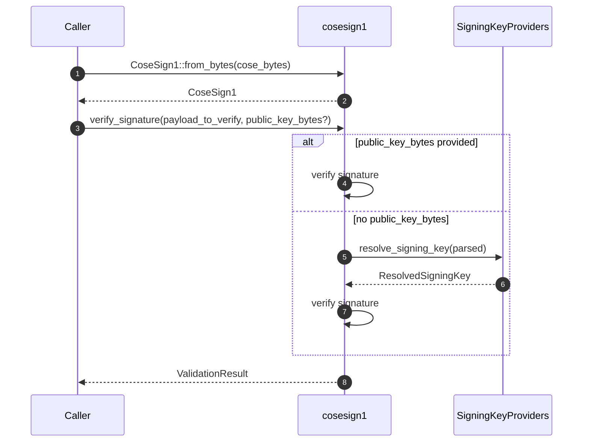
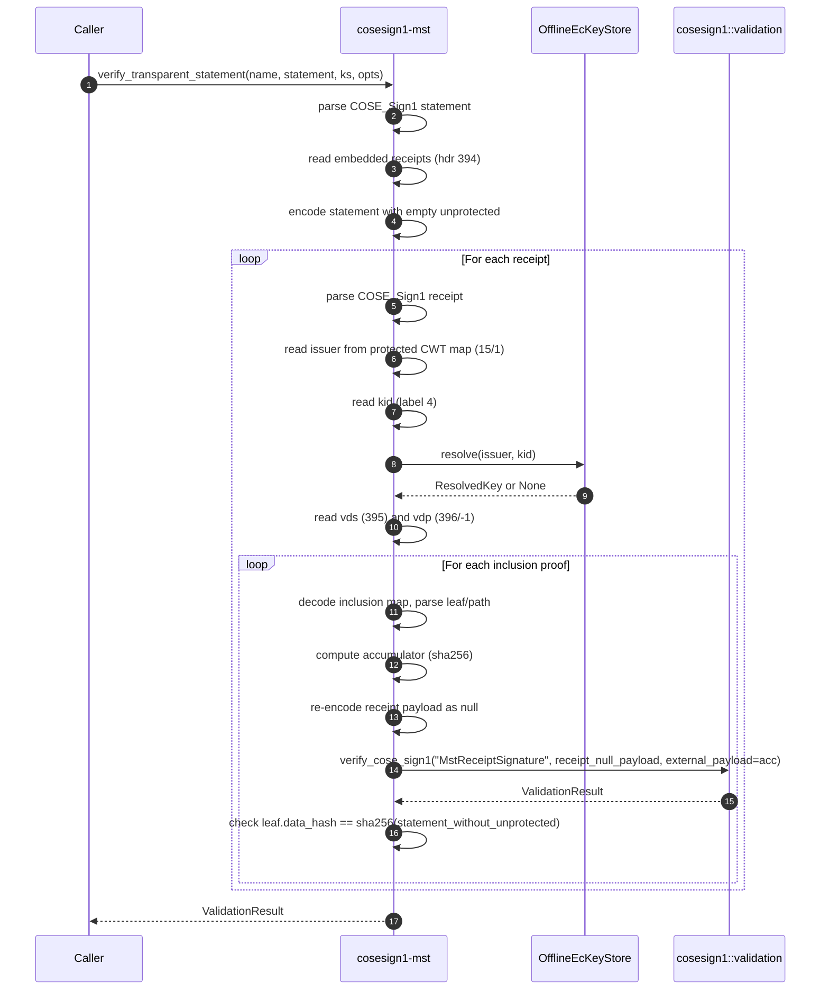

<!--
Copyright (c) Microsoft Corporation.
Licensed under the MIT License.
-->

# Sequence diagrams

These diagrams are intended to help new contributors understand the call flow and where to extend behavior.

## Basic COSE_Sign1 verification



## MST offline verification (transparent statement)



## MST online mode (JWKS fallback)

```mermaid
sequenceDiagram
    autonumber
    participant App as Caller
    participant MST as cosesign1-mst
    participant Cache as OfflineEcKeyStore
    participant Fetch as JwksFetcher

    App->>MST: verify_transparent_statement_online(name, stmt, cache, fetcher, opts)
    MST->>MST: verify_transparent_statement(...)
    alt Valid
        MST-->>App: success
    else Invalid and network allowed
        MST->>MST: build issuer set from opts.authorized_domains
        loop For each issuer
            MST->>Fetch: fetch_jwks(issuer, jwks_path, timeout)
            Fetch-->>MST: jwks bytes (or error)
            MST->>MST: parse JWKS JSON; filter EC keys; JWK->SPKI
            MST->>Cache: insert(issuer, kid, key)
        end
        MST->>MST: verify_transparent_statement(...) (second pass)
        MST-->>App: result
    end
```
